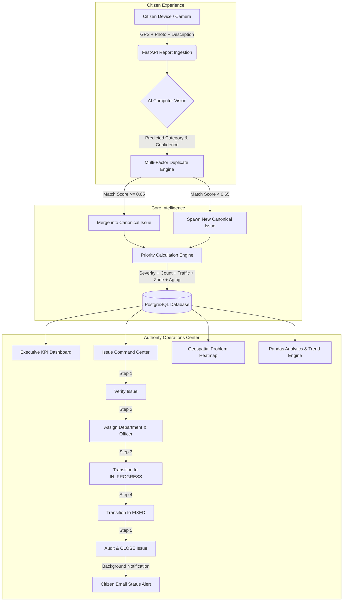

# AI-Powered Crowdsourced Road Infrastructure Monitoring & Management Platform

[](https://github.com/SanthoskrishnaG/CrowdSourced_Road_Safety/actions)
[](https://www.python.org/downloads/)
[](https://fastapi.tiangolo.com)
[](https://www.docker.com/)
[]()
[](https://opensource.org/licenses/MIT)

An enterprise-grade, crowdsourced civic technology platform that empowers citizens to report road hazards (potholes, broken streetlights, road damage, flooding, garbage, etc.) and provides municipal authorities with an AI-driven command center to verify, prioritize, dispatch, track, and resolve infrastructure issues.

---

## 1. Problem Statement
Municipal road maintenance currently suffers from critical systemic inefficiencies:
1. **Fragmented & Slow Citizen Reporting**: Citizens encounter road hazards but lack a streamlined, geolocation-aware mechanism to alert city departments.
2. **Duplicate Report Clutter**: Severe hazards (like major highway potholes) trigger dozens of redundant citizen reports, overwhelming municipal helpdesks.
3. **Subjective Prioritization**: Repair crews lack real-time risk scoring, resulting in critical high-traffic hazards waiting behind low-severity issues.
4. **Opaque Resolution Lifecycle**: Citizens have no visibility into whether their submissions are verified, assigned, or fixed, eroding civic engagement.

---

## 2. Solution Overview
The **Road Safety Platform** bridges the gap between citizens and municipal authorities through an intelligent end-to-end pipeline:
- **AI Computer Vision**: Automatically classifies road damage categories and calibrates model confidence from uploaded evidence photos.
- **Multi-Factor Duplicate Detection**: Merges proximate citizen submissions into canonical issues using spatial, category, temporal, and perceptual dHash image algorithms.
- **Dynamic Priority Engine**: Calculates dynamic 0–100 priority scores factoring in hazard severity, report frequency saturation, traffic density, sensitive zones, and aging acceleration.
- **Authority Operations Command Center**: Provides municipal officers with real-time KPI metrics, search/filtering, department assignment workflows, and resolution time analytics.
- **Geographic Problem Density Heatmap**: Visualizes spatial hazard concentrations using Leaflet-powered heatmaps.

---

## 3. Architecture & End-to-End Workflow



---

## 4. Key Features

### Citizen Portal
- **Geolocation-Tagged Submissions**: GPS coordinates capture with reverse-geocoded street addresses.
- **Photographic Evidence Upload**: Multi-image attachments with automatic thumbnail generation and metadata extraction.
- **Real-Time AI Vision Preview**: Instant preview of hazard classification before submission.
- **Personal Report Tracking**: Real-time status inspection (`REPORTED` $\to$ `VERIFIED` $\to$ `ASSIGNED` $\to$ `IN_PROGRESS` $\to$ `FIXED` $\to$ `CLOSED`).

### Authority Command Center
- **Executive KPI Monitoring**: Live counters for total reports, active issues, critical hazards, awaiting verification, in progress, and resolved issues.
- **Turnaround Velocity Metrics**: Average resolution time calculation ($T_{\text{reported} \to \text{fixed}}$ and $T_{\text{reported} \to \text{closed}}$) using Pandas time-delta modeling.
- **Search & Multi-Factor Filtering**: Instant full-text search across titles, descriptions, and addresses combined with category, severity, status, priority, and department filters.
- **Issue Inspector Drawer**: Complete audit history, contributing citizen submissions, photo gallery with full-screen zoom, priority breakdown gauges, and workflow action forms.
- **Department Dispatch**: Direct assignment to municipal divisions:
  - Roads & Highways (`ROAD_DEPARTMENT`)
  - Electrical & Lighting (`ELECTRICAL_DEPARTMENT`)
  - Sanitation & Waste (`SANITATION_DEPARTMENT`)
  - Traffic Management (`TRAFFIC_DEPARTMENT`)
  - Storm Drainage (`DRAINAGE_DEPARTMENT`)
  - General Public Works (`GENERAL_WORKS`)

### Analytics & Geographic Heatmap
- **Interactive Leaflet Heatmap**: Dynamic weighted spatial problem density visualization (`leaflet-heat`).
- **Time-Series Trends**: Incident and resolution trends aggregated by Day, Week, and Month.
- **Category & Severity Risk Profiling**: Donut and polar area distributions of infrastructure hazards.
- **Spatial Clustering**: Automated grid binning (~1.1 km) identifying recurring municipal hotspots.

---

## 5. Technology Stack

| Layer | Technologies |
| :--- | :--- |
| **Backend Framework** | Python 3.12, FastAPI 0.110.0, Starlette, Uvicorn, Gunicorn |
| **Database & ORM** | PostgreSQL 16, SQLAlchemy 2.0, Alembic (Migrations), SQLite (Testing) |
| **Data Science & ML** | Scikit-Learn 1.4, Pandas 2.2, NumPy 2.5, Scipy 1.10, Pillow 10.2, Joblib |
| **Security & Auth** | PyJWT (HMAC-SHA256), Bcrypt, Role-Based Access Control (RBAC), Rate Limiting |
| **Frontend UI** | Modern HTML5, Vanilla CSS3 (Glassmorphism / Dark Theme), Vanilla JavaScript (ES6+) |
| **Mapping & Charts** | Leaflet.js 1.9.4, Leaflet.markercluster 1.5.3, Leaflet.heat 0.2.0, Chart.js 4.4.1 |
| **DevOps & Testing** | Docker, Docker Compose, GitHub Actions CI/CD, pytest 9.1 |

---

## 6. AI/ML Computer Vision Pipeline

The platform incorporates an image classification model (`road-vision-v1.0`) trained on road hazard datasets.

```text
Input Image (JPG/PNG)
  │
  ├── 1. Validation & Magic Byte Inspection
  ├── 2. Aspect-Ratio Preserving Letterbox Padding (128x128)
  ├── 3. Spatial Feature Extraction (Color Moments + Multi-Scale Edge Histograms)
  ├── 4. Feature Standardization & Inference (Gradient Boosted Classifier)
  └── 5. Platt Scaling Confidence Calibration & Top-K Softmax Probabilities
```

- **Supported Classes**: `POTHOLE`, `ROAD_DAMAGE`, `BROKEN_STREETLIGHT`, `FLOODING`, `GARBAGE`, `DAMAGED_SIGN`, `BLOCKED_ROAD`, `OTHER`.
- **Human-in-the-Loop Override**: Municipal inspectors can verify or override AI predictions; overrides are logged for continuous model retraining.

---

## 7. Multi-Factor Duplicate Detection Algorithm

When a citizen submits a report, the system searches active canonical issues within 50 meters and computes a composite similarity score $S$:

$$S = \frac{w_{\text{loc}} \cdot S_{\text{loc}} + w_{\text{cat}} \cdot S_{\text{cat}} + w_{\text{time}} \cdot S_{\text{time}} + w_{\text{img}} \cdot S_{\text{img}}}{w_{\text{loc}} + w_{\text{cat}} + w_{\text{time}} + w_{\text{img}}}$$

### Component Formulations:
1. **Geographic Proximity ($S_{\text{loc}}$)**:
   $$S_{\text{loc}} = \begin{cases} 1.0 & \text{if } d \le 15\text{m} \\ 1.0 - \frac{d - 15}{35} & \text{if } 15\text{m} < d \le 50\text{m} \\ 0.0 & \text{if } d > 50\text{m} \end{cases}$$
   *(where $d$ is the Haversine distance in meters)*

2. **Category Taxonomy ($S_{\text{cat}}$)**:
   $$S_{\text{cat}} = \begin{cases} 1.0 & \text{if exact match} \\ 0.5 & \text{if related category (e.g. POTHOLE} \leftrightarrow \text{ROAD\_DAMAGE)} \\ 0.0 & \text{otherwise} \end{cases}$$

3. **Time Decay ($S_{\text{time}}$)**:
   $$S_{\text{time}} = \max\left(0.1, 1.0 - \frac{\Delta t_{\text{days}}}{30}\right)$$

4. **Perceptual Image Hash ($S_{\text{img}}$)**:
   $$S_{\text{img}} = 1.0 - \frac{\text{HammingDistance}(\text{dHash}_A, \text{dHash}_B)}{64}$$

**Decision Rule**: If $S \ge 0.65$, the report merges into the canonical issue, incrementing its `report_count` and upgrading severity if applicable. Otherwise, a new canonical `Issue` is spawned.

---

## 8. Multi-Factor Priority Engine

Issues are dynamically prioritized on a **0 to 100 continuous score**:

$$\text{Priority Score} = \text{Clamp}\left(S_{\text{sev}} + S_{\text{count}} + S_{\text{traffic}} + S_{\text{zone}} + S_{\text{aging}}, 0, 100\right)$$

| Factor | Weight Range | Details |
| :--- | :--- | :--- |
| **Severity ($S_{\text{sev}}$)** | 0 – 40 pts | `CRITICAL` (40), `HIGH` (30), `MEDIUM` (18), `LOW` (8) |
| **Citizen Reports ($S_{\text{count}}$)** | 0 – 25 pts | Logarithmic saturation: $\min(25, 8 \cdot \ln(N + 1))$ |
| **Traffic Density ($S_{\text{traffic}}$)** | 0 – 15 pts | `HEAVY` (15), `MEDIUM` (8), `LOW` (3) |
| **Location Zone ($S_{\text{zone}}$)** | 0 – 10 pts | `HOSPITAL` (10), `SCHOOL` (9), `JUNCTION` (8), `MAIN_ROAD` (6), `RESIDENTIAL` (3) |
| **Aging Acceleration ($S_{\text{aging}}$)** | 0 – 15 pts | Unresolved aging: $\min(15, 0.75 \cdot \text{days\_open})$ *(Freezes upon FIXED/CLOSED)* |

### Priority Thresholds:
- **`CRITICAL`**: Score $\ge 75$
- **`HIGH`**: $50 \le \text{Score} < 75$
- **`MEDIUM`**: $25 \le \text{Score} < 50$
- **`LOW`**: $\text{Score} < 25$

---

## 9. Database Design

```text
  ┌──────────────┐         1:N          ┌────────────────┐
  │    users     │─────────────────────<│    reports     │
  └──────────────┘                      └────────────────┘
         │                                       │
         │ 1:N                                   │ N:1
         ▼                                       ▼
  ┌──────────────────────┐              ┌────────────────┐
  │  issue_assignments  │              │     issues     │
  └──────────────────────┘              └────────────────┘
         ▲                                       │
         │ 1:N                                   │ 1:N
         └───────────────────────────────────────┤
                                                 ▼
                                        ┌──────────────────────┐
                                        │ issue_status_history │
                                        └──────────────────────┘
```

### Performance Indexes:
- `idx_issues_lat_long` on `issues(latitude, longitude)`
- `idx_issues_status_priority` on `issues(status, priority_level)`
- `idx_reports_lat_long` on `reports(latitude, longitude)`
- `idx_reports_status_created` on `reports(status, created_at)`
- B-Tree indexes on `status`, `category`, `severity`, `priority_score`, `created_at`, `reporter_id`, `issue_id`.

---

## 10. API Documentation Reference

All endpoints return standardized JSON envelopes. Complete interactive Swagger documentation is available at `/docs`.

### Authentication & Profiles
- `POST /api/v1/auth/register`: Create user account (`CITIZEN`, `AUTHORITY`, `ADMIN`).
- `POST /api/v1/auth/login`: Authenticate and receive JWT Bearer token.
- `GET /api/v1/auth/me`: Get current user profile.

### Reports & Photographic Evidence
- `POST /api/v1/reports`: Submit road hazard report (triggers duplicate detection & AI classification).
- `GET /api/v1/reports`: Paginated list of reports with attribute filters.
- `GET /api/v1/reports/my`: List reports submitted by authenticated user.
- `POST /api/v1/reports/{id}/images`: Upload multi-part evidence photos.
- `POST /api/v1/reports/classify-image`: Standalone AI Vision classifier preview.

### Canonical Issue Management (Authority Protected)
- `GET /api/v1/issues`: Paginated list with keyword search (`search`) and multi-factor filters.
- `GET /api/v1/issues/{id}`: Detailed issue profile with priority breakdown and contributing reports.
- `POST /api/v1/issues/{id}/verify`: Verify issue (`REPORTED` $\to$ `VERIFIED`).
- `POST /api/v1/issues/{id}/assign`: Assign department and officer (`VERIFIED` $\to$ `ASSIGNED`).
- `POST /api/v1/issues/{id}/status`: Lifecycle transitions (`IN_PROGRESS`, `FIXED`, `CLOSED`, `REJECTED`).
- `POST /api/v1/issues/{id}/comments`: Post internal audit note.

### Analytics & Heatmaps (Authority Protected)
- `GET /api/v1/analytics/summary`: KPI summary metrics & average turnaround hours.
- `GET /api/v1/analytics/categories`: Category volume and percentage shares.
- `GET /api/v1/analytics/severity`: Severity breakdown.
- `GET /api/v1/analytics/status`: Lifecycle status breakdown.
- `GET /api/v1/analytics/resolution`: Average resolution times ($T_{\text{fixed}}$, $T_{\text{closed}}$).
- `GET /api/v1/analytics/geographic`: Spatial problem density hotspots.
- `GET /api/v1/analytics/trends`: Incident and resolution rates over `day`, `week`, or `month`.
- `GET /api/v1/analytics/heatmap`: Intensity-weighted geospatial points for Leaflet heatmap.

---

## 11. Local Setup & Quickstart

### Prerequisites
- Python 3.12+
- PostgreSQL 16+ (or SQLite for local testing)

### Installation
```bash
# 1. Clone repository
git clone https://github.com/SanthoskrishnaG/CrowdSourced_Road_Safety.git
cd CrowdSourced_Road_Safety

# 2. Create and activate virtual environment
python -m venv venv
venv\Scripts\activate  # Windows
# source venv/bin/activate  # Linux/macOS

# 3. Install backend dependencies
pip install -r backend/requirements.txt

# 4. Configure environment variables
cp .env.example .env

# 5. Run database migrations
cd backend
alembic upgrade head

# 6. Start backend development server
uvicorn app.main:app --host 0.0.0.0 --port 8000 --reload
```

### Accessing the Web Application:
- **Authority Dashboard & Public Map**: Open `frontend/index.html` in your browser.
- **Interactive API Docs (Swagger)**: Navigate to `http://localhost:8000/docs`.
- **Health Check**: `http://localhost:8000/api/v1/health/healthz`.

---

## 12. Docker & Container Deployment

Start the complete production stack (PostgreSQL + FastAPI Web Backend + Volume Storage) with a single command:

```bash
docker compose up -d --build
```

### Stopping Services:
```bash
docker compose down
```

---

## 13. Automated Testing & Verification

The test suite covers unit logic, security middleware, AI vision inference, mathematical duplicate detection, priority scoring, workflow transitions, and full 15-step end-to-end integration:

```bash
venv\Scripts\pytest -v
```

### Test Suite Summary:
```text
======================= 82 passed, 1 skipped in 33.93s =======================
```

---

## 14. Project Directory Structure

```text
CrowdSourced_Road_Safety/
├── .github/
│   └── workflows/
│       └── ci.yml                 # Automated CI/CD testing & build pipeline
├── backend/
│   ├── alembic/                  # Database migration version scripts
│   ├── app/
│   │   ├── api/                  # Versioned API routes & role dependencies
│   │   ├── core/                 # Config, security, logging, middlewares, exceptions
│   │   ├── models/               # SQLAlchemy models (User, Report, Issue, Assignment, History)
│   │   ├── schemas/              # Pydantic validation & response schemas
│   │   ├── services/             # Duplicate detector, priority engine, ML service, analytics, notifications
│   │   ├── utils/                # Geo Haversine distance, image processing
│   │   └── main.py               # FastAPI application entrypoint
│   ├── tests/                    # 82 automated unit, integration, and E2E test suites
│   ├── Dockerfile                # Hardened multi-stage production Dockerfile
│   └── requirements.txt          # Python production dependencies
├── docs/
│   ├── duplicate_detection.md    # Duplicate detection mathematical specification
│   └── deployment.md             # Production cloud deployment guide (Render, AWS, Railway)
├── frontend/
│   ├── css/
│   │   └── style.css             # Glassmorphism dark-mode design system
│   ├── js/
│   │   └── app.js                # Interactive dashboard, maps, Chart.js, and workflows
│   └── index.html                # Responsive Authority Command Center UI
├── ml/                           # Trained ML model weights and preprocessing pipelines
├── docker-compose.yml            # Container orchestration config
├── .env.example                  # Environment variables template
└── README.md                     # Platform documentation
```

---

## 15. Future Roadmap & Advanced Capabilities

All planned advanced roadmap capabilities are implemented and verified:
- [x] **Mobile Progressive Web App (PWA)** with offline draft queueing and background sync via IndexedDB & Service Worker (`sw.js`).
- [x] **Automated Work-Order PDF Generation** for field crews using ReportLab with geolocation, priority score banners, and inspection sign-off blocks.
- [x] **Citizen SMS Status Alerts** via Twilio integration with automatic SMS dispatch on issue verification, assignment, and resolution.
- [x] **Edge ML Inference on Dashcam Video Streams** with temporal persistence filtering, GPS interpolation, and direct frame-to-report generation.

---

## 16. License

This project is licensed under the MIT License — see the [LICENSE](LICENSE) file for details.
