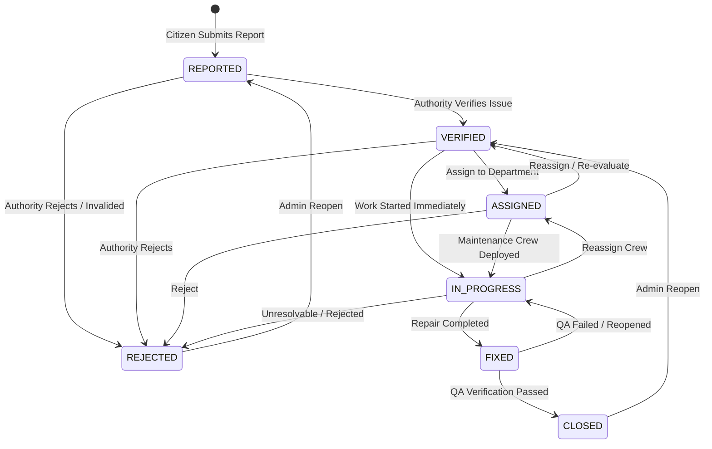

# Phase 8 — Priority Engine and Issue Workflow Documentation

## 1. Overview & Objectives

Phase 8 introduces:
1. An **intelligent multi-factor priority engine** scoring issues on a continuous normalized $0–100$ scale and categorizing them into priority levels (`CRITICAL`, `HIGH`, `MEDIUM`, `LOW`).
2. A **strict state machine workflow** guiding road hazards from initial report through authority verification, department assignment, remediation, resolution, and closure.
3. A **municipal department routing taxonomy** (`ROAD_DEPARTMENT`, `ELECTRICAL_DEPARTMENT`, `SANITATION_DEPARTMENT`, `TRAFFIC_DEPARTMENT`, `DRAINAGE_DEPARTMENT`, `GENERAL_WORKS`).
4. An **immutable audit trail** tracking all status transitions, timestamps, actor attribution, and authority comments.

---

## 2. Multi-Factor Priority Engine (0–100 Scale)

The priority score is computed dynamically across 5 weighted factors:

$$\text{Priority Score} = \min(100.0, \max(0.0, S_{\text{severity}} + S_{\text{count}} + S_{\text{traffic}} + S_{\text{location}} + S_{\text{aging}}))$$

### Factor Breakdown

| Factor | Weight Range | Details |
|---|---|---|
| **Severity ($S_{\text{severity}}$)** | $5.0 - 35.0$ pts | `CRITICAL` = 35.0, `HIGH` = 25.0, `MEDIUM` = 15.0, `LOW` = 5.0 |
| **Report Count ($S_{\text{count}}$)** | $10.0 - 20.0$ pts | 1 report = 10.0 pts; 2 = 13.5 pts; 3 = 17.0 pts; $\ge 4 = 20.0$ pts (max) |
| **Traffic Density ($S_{\text{traffic}}$)** | $5.0 - 15.0$ pts | `HEAVY` = 15.0, `MEDIUM` = 10.0, `LOW` = 5.0 (Extensible traffic service) |
| **Location Zone ($S_{\text{location}}$)** | $3.0 - 15.0$ pts | `HOSPITAL` = 15.0, `SCHOOL` = 13.0, `MAIN_ROAD` / `JUNCTION` = 10.0, `RESIDENTIAL` = 5.0, `OTHER` = 3.0 |
| **Time Unresolved Aging ($S_{\text{aging}}$)** | $0.0 - 15.0$ pts | $+1.5$ pts per 24 hours unresolved while in active status (capped at 10+ days). 0 pts when fixed/closed. |

### Priority Levels & Thresholds

| Priority Level | Score Range | SLA / Operational Target |
|---|---|---|
| **CRITICAL** | $\ge 80.0$ | Immediate emergency dispatch ($\le 4\text{ hours}$) |
| **HIGH** | $60.0 \le \text{Score} < 80.0$ | High priority remediation ($\le 24\text{ hours}$) |
| **MEDIUM** | $40.0 \le \text{Score} < 60.0$ | Standard municipal schedule ($\le 3 - 5\text{ days}$) |
| **LOW** | $< 40.0$ | Routine maintenance backlog ($\le 14\text{ days}$) |

---

## 3. State Machine & Issue Lifecycle

---

## 4. Municipal Department Routing Taxonomy

When an issue is spawned or verified, it is automatically routed to the responsible department based on category:

| Hazard Category | Default Department |
|---|---|
| `POTHOLE`, `ROAD_DAMAGE` | `ROAD_DEPARTMENT` |
| `BROKEN_STREETLIGHT` | `ELECTRICAL_DEPARTMENT` |
| `GARBAGE` | `SANITATION_DEPARTMENT` |
| `DAMAGED_SIGN`, `BLOCKED_ROAD`, `OBSTRUCTION` | `TRAFFIC_DEPARTMENT` |
| `FLOODING` | `DRAINAGE_DEPARTMENT` |
| `OTHER` | `GENERAL_WORKS` |

---

## 5. Database Models

### `issue_assignments`
* `id`: UUID (PK)
* `issue_id`: UUID (FK to `issues.id`, CASCADE)
* `department`: `AuthorityDepartment` Enum
* `assigned_to_user_id`: UUID (FK to `users.id`, Nullable)
* `assigned_by_user_id`: UUID (FK to `users.id`)
* `assigned_at`: DateTime
* `notes`: Text (Nullable)
* `is_active`: Boolean

### `issue_status_history`
* `id`: UUID (PK)
* `issue_id`: UUID (FK to `issues.id`, CASCADE)
* `previous_status`: `ReportStatus` Enum (Nullable)
* `new_status`: `ReportStatus` Enum
* `changed_by_user_id`: UUID (FK to `users.id`)
* `comment`: Text (Nullable)
* `created_at`: DateTime

---

## 6. API Reference

| Method | Endpoint | Role | Description |
|---|---|---|---|
| `GET` | `/api/v1/issues` | All (Citizen/Auth/Admin) | List issues with filters (`status`, `priority_level`, `department`, `min_priority_score`) |
| `GET` | `/api/v1/issues/{id}` | All | Detailed issue view with reports, active assignment, audit history, and priority breakdown |
| `POST` | `/api/v1/issues/{id}/verify` | Authority, Admin | Verify issue (`REPORTED` $\rightarrow$ `VERIFIED`) |
| `POST` | `/api/v1/issues/{id}/assign` | Authority, Admin | Assign issue to department & officer |
| `POST` | `/api/v1/issues/{id}/status` | Authority, Admin | Transition issue status (`IN_PROGRESS`, `FIXED`, `CLOSED`, `REJECTED`) |
| `POST` | `/api/v1/issues/{id}/comments` | Authority, Admin | Post internal audit note or progress comment |
| `GET` | `/api/v1/issues/{id}/history` | All | View complete chronological status and comment audit trail |
| `POST` | `/api/v1/issues/{id}/recalculate-priority` | Authority, Admin | Recompute priority score based on latest aging and factors |
